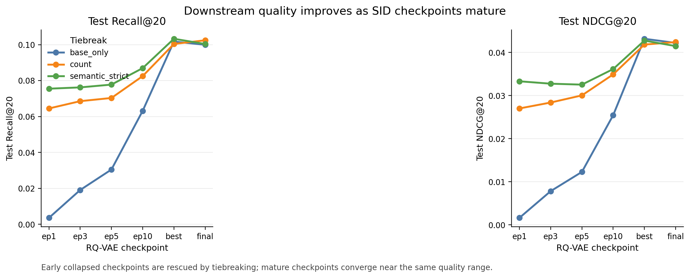
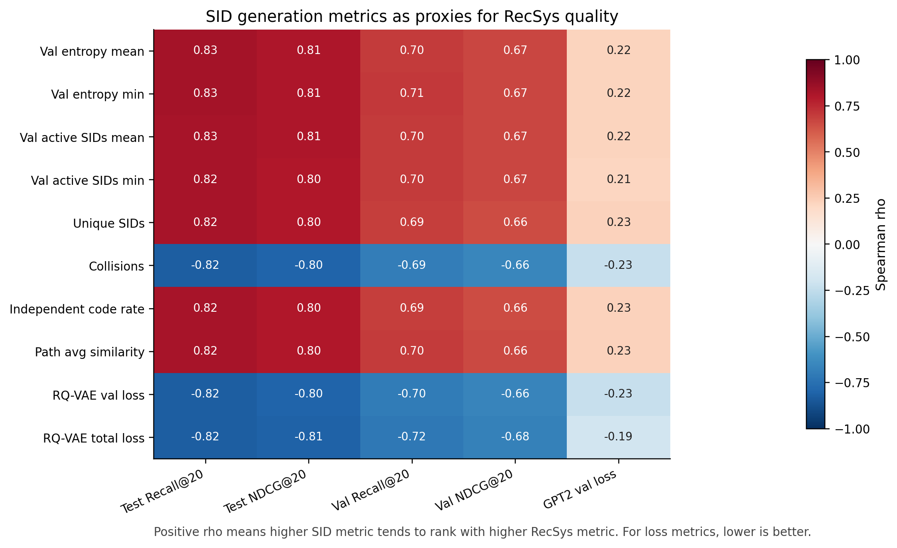

# Generative Retrieval with Pre-trained Transformers


This repository contains a notebook-based research project for generative
retrieval in sequential recommendation. The workflow builds item
representations, learns residual-quantized semantic identifiers with RQ-VAE
variants, and uses a GPT-style sequence model for recommendation analysis.

The project is intentionally kept close to the original exploratory notebooks.
The repository is organized so that the data, notebooks, and report-ready
results are easy to inspect without changing the experimental logic.

## Repository Status

- The project is organized around Jupyter notebooks rather than command-line
  training scripts.
- The repository includes prepared data artifacts in `data/`.
- Some notebooks still contain environment-specific paths from the original
  working setup, including Kaggle paths and local Windows paths. Update the
  `DATA_PATH`, checkpoint, and output directory variables inside the notebooks
  before running them in a new environment.
- No official experiment metrics or paper-ready results are claimed here beyond
  what is already visible in the notebooks.

## Project Structure

```text
.
+-- data/
|   +-- datamaps.json              # User/item/attribute id mappings
|   +-- heterodata_object.pt        # Prepared PyTorch/PyG data object
|   +-- meta.json.gz                # Compressed item metadata
|   `-- sequential_data.txt         # User interaction sequences
+-- notebooks/
|   +-- data_prep_diff_emb.ipynb   # Data preparation and embedding workflow
|   +-- RQVAE_train_stage.ipynb    # Contrastive RQ-VAE training workflow
|   +-- RQVAE_AntiContrastive_train.ipynb
|   |                               # Anti-contrastive RQ-VAE variant
|   `-- GPT2_Rec_Analysis.ipynb    # GPT-style recommendation analysis
+-- results/
|   +-- figures/                   # Report figures
|   `-- tables/                    # Final CSV summaries and paired tests
+-- requirements.txt               # Python dependencies inferred from notebooks
+-- CONTRIBUTING.md                # Lightweight development notes
`-- LICENSE                        # License status note
```

## Installation

The notebooks were authored with Python 3.12 kernels. A GPU-enabled PyTorch
setup is recommended for training, but the exact PyTorch build depends on your
CUDA/CPU environment.

```bash
python -m venv .venv
```

On Windows:

```bash
.venv\Scripts\activate
python -m pip install --upgrade pip
python -m pip install -r requirements.txt
```

On macOS/Linux:

```bash
source .venv/bin/activate
python -m pip install --upgrade pip
python -m pip install -r requirements.txt
```

If you need CUDA support, install the PyTorch build that matches your system
before installing the rest of the requirements.

```bash
jupyter lab
```

Open notebooks from the repository root so that relative paths such as `data/`
resolve consistently.

If your Jupyter kernel starts inside `notebooks/`, run `%cd ..` in a setup cell
or adjust the data paths before executing the workflow.

## Data

The tracked `data/` directory contains the files required by the preparation
and modeling notebooks:

- `sequential_data.txt`: integer item sequences per user.
- `datamaps.json`: mappings between original ids and internal numeric ids.
- `meta.json.gz`: compressed item metadata used during feature construction.
- `heterodata_object.pt`: serialized PyTorch/PyG object for downstream models.

The training notebooks currently refer to `heterodata_object12_updated.pt` in
their original Kaggle/local paths. When running locally, either update
`DATA_PATH` to point at `data/heterodata_object.pt` if that artifact is suitable
for your run, or regenerate the updated artifact from
`notebooks/data_prep_diff_emb.ipynb` and place it where the training notebooks
expect it.

## Usage

Run the notebooks in the following order for the full workflow:

1. `notebooks/data_prep_diff_emb.ipynb`
   - Loads the sequential data, metadata, and id maps.
   - Builds item-side representations and a heterogeneous data object.
   - Saves a prepared `.pt` artifact for model training.

2. `notebooks/RQVAE_train_stage.ipynb`
   - Trains the main RQ-VAE semantic-id model.
   - Saves checkpoints named like `rqvae_improved_s{session}.pt`.

3. `notebooks/RQVAE_AntiContrastive_train.ipynb`
   - Trains the anti-contrastive RQ-VAE variant.
   - Saves checkpoints named like `rqvae_anti_s{session}.pt`.

4. `notebooks/GPT2_Rec_Analysis.ipynb`
   - Loads trained RQ-VAE checkpoints.
   - Assigns semantic ids to items.
   - Trains/evaluates a GPT-style sequential recommendation model.
   - Saves GPT recommendation checkpoints and plots when configured.

## Results Summary

The `results/` directory contains compact artifacts prepared from the local
coursework/report runs. These values should be read as validation results for
the documented experimental setup, not as benchmark claims for a new dataset or
paper.

### RQ-VAE Semantic Identifier Quality

The paired multi-seed comparison used 10 RQ-VAE seeds. Higher Independent Code
Rate and lower Collision Rate indicate cleaner semantic identifiers.

| RQ-VAE variant | Independent Code Rate | Collision Rate | Unique SIDs | Mean code entropy |
| --- | ---: | ---: | ---: | ---: |
| Contrastive | 0.962 +/- 0.009 | 0.038 +/- 0.009 | 11643.7 +/- 103.8 | 7.659 +/- 0.104 |
| Anti-contrastive | 0.712 +/- 0.089 | 0.288 +/- 0.089 | 8612.8 +/- 1076.1 | 6.175 +/- 0.200 |

The contrastive version won 10/10 paired RQ-VAE runs by Independent Code Rate.
The mean paired improvement was 0.250, with a bootstrap 95% CI of
`[0.201, 0.304]` and one-sided Wilcoxon `p=0.00098`.

Source tables:

- `results/tables/table_rqvae_summary_by_loss.csv`
- `results/tables/table_rqvae_paired_stat_test.csv`

### GPT2Rec Downstream Quality

The downstream comparison used 30 paired runs: 10 RQ-VAE seeds times 3 GPT2Rec
seeds. The contrastive identifiers won all 30 paired runs for Recall, NDCG, and
MRR metrics tracked in the report tables.

| RQ-VAE identifiers | Recall@10 | Recall@20 | NDCG@10 | NDCG@20 | MRR |
| --- | ---: | ---: | ---: | ---: | ---: |
| Contrastive | 0.01303 +/- 0.00255 | 0.02069 +/- 0.00369 | 0.00650 +/- 0.00151 | 0.00843 +/- 0.00177 | 0.00563 +/- 0.00134 |
| Anti-contrastive | 0.00247 +/- 0.00129 | 0.00429 +/- 0.00149 | 0.00134 +/- 0.00093 | 0.00180 +/- 0.00088 | 0.00149 +/- 0.00085 |

For NDCG@10, the mean paired improvement was 0.00517 with bootstrap 95% CI
`[0.00451, 0.00584]`; one-sided Wilcoxon `p=9.31e-10`.

Source tables:

- `results/tables/table_gpt2_summary_by_loss.csv`
- `results/tables/table_gpt2_paired_stat_tests.csv`
- `results/tables/table_gpt2_paired_by_seed.csv`

### Additional Report Findings

- For 3-level RQ-VAE identifiers, an additional semantic tie-breaking code
  improved Recall@20 from 0.07858 to 0.08352 in the report run.
- For 4-level RQ-VAE identifiers, the best reported Recall@20 was 0.08624 with
  the base identifier, without adding a fifth code.
- In checkpoint analysis, the best reported Recall@20 reached 0.10180.
- Mean code entropy was strongly associated with recommendation quality:
  Spearman correlation was 0.831 with Recall@20 and 0.812 with NDCG@20.





## Training and Evaluation

Training hyperparameters such as batch size, number of epochs, learning rate,
codebook size, number of RQ-VAE layers, and checkpoint directories are defined
inside the notebooks. Review those cells before launching a run.

Expected generated artifacts include:

- `rqvae_improved_s*.pt`
- `rqvae_anti_s*.pt`
- `gpt2rec_imp_best.pt`
- `gpt2rec_anti_best.pt`
- `gpt2rec_results.png`

These generated artifacts are ignored by `.gitignore` so that large experiment
outputs are not accidentally committed.

## Development Notes

There are no standalone unit tests in the original repository. For lightweight
checks after edits, validate that the notebooks are readable JSON and that the
documented dependency list still matches notebook imports.

```bash
jupyter nbconvert --to notebook --execute notebooks/RQVAE_train_stage.ipynb --ExecutePreprocessor.cwd=.
```

The command above executes a full notebook and may be slow or require a GPU and
correct local data paths. For documentation-only changes, JSON parsing of the
notebooks is usually a safer smoke check.

## Citation and References

No canonical BibTeX entry or publication metadata was included in the upstream
repository. If this project is submitted for coursework or publication, cite the
course/project repository and add formal citations for the specific generative
retrieval, RQ-VAE, transformer, dataset, and embedding-model references used in
your report.

Core libraries used by the notebooks include:

- PyTorch
- PyTorch Geometric
- Sentence-Transformers
- Gensim
- Jupyter

## License

The upstream repository did not include an explicit open-source license at the
time of this cleanup. See `LICENSE` for the current license-status note. Choose
and add a concrete license before redistributing this project as open source.
